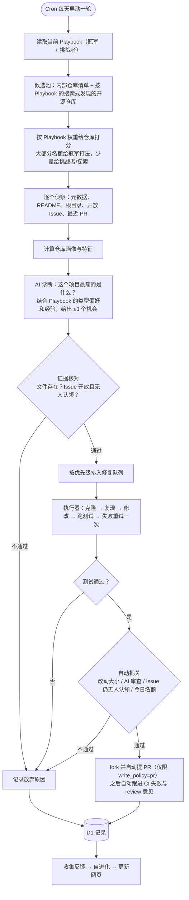
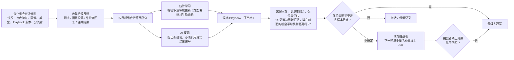

# Bug Hunter RSI 框架需求 v2

> 本文档替代 `docs/plans/2026-09-23-*`，那一版把项目做成了“给自己的 API 做体检 + 合成基准打分”，偏离了主题。

## 0. 一句话定位

**Bug Hunter 是一个在 GitHub 仓库里找 Bug、找改进机会、动手修，并从 PR 结果里学习的机器人。**

- **自动化**负责“每天照常跑”：选仓库 → 读仓库 → 找机会 → 验证 → 修 → 提交审核 → 记录。
- **自进化**负责“下一次跑得不一样，而且能证明更好”：系统根据真实结果（测试、团队意见、维护者回复、PR 是否合并）改写自己的**打法手册（Playbook）**，并用历史证据比较新旧打法，只有更好的才会接管下一轮。

判别标准：如果连续 30 天每天做的事完全一样，只是数据变多了，那是自动化；如果第 30 天挑的仓库、选的方向、写 PR 的方式都和第 1 天不同，并且能指着证据说明为什么改、改完好了多少，那才是自进化。

## 1. 与 AI 自进化带练三个阶段的对应

| 阶段 | 要求 | 本项目对应 |
|---|---|---|
| 第 1 阶段 | AI 生成 HTML5 页面（介绍 + 图 + 表），发布到 Cloudflare | `index.html`：项目介绍、流程图、进化树、仓库/机会/修复历史表，部署在 Cloudflare Worker |
| 第 2 阶段 | cron job 每天自检、自进化，不是“抓数据→摘要” | Cron 每天推进一轮狩猎；每轮末尾收集反馈、改写 Playbook、做新旧对比 |
| 第 3 阶段 | Ken 检查“树能长成什么样”，“光模拟没结果就不好看” | 页面的 **Playbook 进化树**：每个节点是一版打法，写明改了什么、依据哪些真实结果、得分多少；所有数字来自真实仓库和真实 PR，不用模拟成绩 |

## 2. 明确不做的事

1. 不是给某个 API 做定时体检。CommandCode 的 URL 和密钥只是 AI 的调用通道。
2. 不用合成基准或模拟成绩冒充成果。没有真实结果时，页面如实显示“证据不足”。
3. 不写死“某类项目必须做某类改动”。项目类型只提供**初始猜测（先验）**，会被结果修正。
4. 不刷 PR。PR 由自动把关代替人工审核（见第 6 节），每天有数量上限，每个仓库同时最多 1 个未结 PR，并在 PR 里说明使用了 AI 辅助。
5. 不擅自改用户自己的仓库。它们默认只读，只产出供审核的补丁。

## 3. 核心概念

| 概念 | 含义 | 例子 |
|---|---|---|
| **目标 Goal** | 这一阶段想优化什么，决定“什么算好结果”（奖励函数） | `contributor` 拿到更多被合并的贡献；`craft` 提高修 Bug 能力；`internal` 让内部工具更好用 |
| **目标组合 Goal Mix** | 多个目标按权重同时进化 | `contributor 0.4 / craft 0.3 / internal 0.3` |
| **赛道 Track** | 仓库来源 | `open-source` 公开开源仓库；`internal` 团队内部工具 |
| **写权限 Write Policy** | 对某个仓库允许做到哪一步 | `readonly` 只研究；`review` 生成补丁待审核；`pr` 审核通过后可提 PR |
| **仓库画像 Repo Profile** | 仓库类型与可测量特征 | 类型：开发工具 / 库 / 内部应用 / 网页应用 / 数据流程 / 通用。特征：外部 PR 合并率、处理速度、活跃度、help wanted 数、热门程度（竞争）、是否有测试、是否有贡献指南、体积 |
| **机会 Opportunity** | 一个具体、可验证的改进点 | 类型：`bug` 真实缺陷、`accuracy` 准确性、`performance` 速度、`slimming` 代码瘦身、`ux-ui` 体验/界面、`small-feature` 有需求的小功能、`competitor-gap` 竞品有而它没有的功能 |
| **证据 Evidence** | 证明机会存在的可核对材料 | 仓库中真实存在的文件路径、仍然开放且无人认领的 Issue、复现命令输出。模型的文字描述**不算**证据 |
| **尝试 Attempt** | 一次修复：补丁 + 测试结果 | 测试通过 / 测试失败 / 放弃（附原因） |
| **结果 Outcome** | 后续反馈折算成的奖励分 | PR 被合并 +1、被关闭 −0.5、团队认为有用 +1 … |
| **打法手册 Playbook** | 所有“可调整偏好”的集合，带版本号和父版本 | 挑仓库权重、项目类型→机会类型偏好、找 Bug 经验、写 PR 经验 |

## 4. 每日狩猎流水线（自动化层）

**大脑与双手分离**：Cloudflare Worker 没有文件系统，不能克隆和跑测试。因此：

- **大脑（Worker + D1 + Cron）**：选仓库、侦察、诊断、证据核对、排队、收集反馈、进化 Playbook、渲染页面。
- **双手（执行器）**：`executor/hunt-fix.mjs`，跑在一台云端 Linux 机器上（例如 Grok Bot 云电脑，`executor/setup-linux.sh` 一键安装，每 2 小时运行一次）。每次运行先跟进已提交的 PR，再领新任务：克隆、复现、修改、测试、自动把关、提 PR，把结果回传 `/api/attempts`。

**Cron 分步推进**：Worker 单次调用的子请求数量有限，所以 Cron 每 20 分钟触发一次，每次只推进一步（规划本轮 → 侦察一个仓库 → … → 收尾进化），每天一轮。

## 5. 自进化层

### 5.1 四个进化维度（对应需求里的场景）

| 维度 | 要回答的问题 | Playbook 里对应的可调参数 | 学习信号 |
|---|---|---|---|
| **E1 挑仓库** | 什么样的仓库维护者更愿意回复、合并外部 PR？ | `repoSelection.weights`（外部合并率、响应速度、活跃度、help wanted、热门程度、测试、贡献指南…）和 `discoveryQueries` | PR 合并/关闭/无人理睬 |
| **E2 挑方向** | 什么类型的项目最需要哪类改动？ | `opportunityPriors[画像][机会类型]`：开发工具偏真实 Bug，内部招聘看板偏准确/快/轻，展示型项目偏 UI，某些项目偏竞品缺口 | 该类型机会的验证通过率、修复成功率、被接受率 |
| **E3 找和修** | 一般哪里容易出 Bug？什么 Bug 怎么修？ | `lessons.hunting`：经验条目，每条带证据编号和置信度，喂给诊断和执行器提示词 | 测试通过/失败、验证被推翻 |
| **E4 写 PR** | 怎样的 PR 更容易被合并？ | `lessons.pr` 与 `prStyle`（改动行数上限、是否先开 Issue、描述结构） | 合并、关闭原因、维护者评论 |

项目类型→机会类型的偏好只是**初始先验**，不是规则：如果“内部应用做 UI 改动”连续被团队否定，这个偏好会下降。

### 5.2 进化机制

硬性规则：

1. **没证据不进化**：已结算结果少于阈值时，只记录“证据不足”，不改 Playbook。
2. **训练 / 保留分开**：按结果编号哈希分组，防止“拿考题练习再用同一份考题打分”。
3. **经验必须有出处**：AI 提出的经验如果没有引用真实结果编号，直接丢弃。
4. **一切可追溯**：每个 Playbook 节点记录父版本、改动明细、证据数量、新旧得分和决策原因。页面把它画成进化树。

### 5.3 奖励函数（按目标）

| 事件 | contributor | craft | internal |
|---|---|---|---|
| 证据核对失败（诊断错了） | 不计 | −0.2 | −0.2 |
| 修复放弃 | 0 | −0.1 | 0 |
| 测试失败 | 0 | −0.3 | −0.2 |
| 测试通过、等待审核 | 待定 | +0.6 | 待定 |
| 团队投票“有用” / 内部接受 | +0.3 | +0.2 | +1 |
| 团队投票“没用” | −0.2 | −0.1 | −0.5 |
| PR 合并 | +1 | +1 | +1 |
| PR 被关闭未合并 | −0.5 | −0.2 | −0.5 |
| PR 超过 21 天无人回复 | −0.2 | 不计 | 不计 |

最终奖励 = 按目标组合权重加权；全部“待定”则该结果不参与学习。

## 6. 全自动提 PR：自动把关代替人工审核

用户的角色只有**验收、管成本、管账号密钥**。参考 Tony 的 skill，每个 PR 提交前必须依次通过：

| 关卡 | 来源 | 不通过时 |
|---|---|---|
| 仓库规则：不接受 AI 贡献 | CONTRIBUTING / README | 放弃并长期拉黑该仓库 |
| 仓库要求 CLA | CONTRIBUTING / `.clabot` | `CLA_POLICY=skip` 时跳过；`flag` 时照常提交并提醒你签一次 |
| Issue 仍开放、无人认领、无关联 PR | Tony：最常见的失败是重复 PR | 放弃 |
| 修改后测试通过（失败带日志重试一次） | 仓库自己的测试 | 记为测试失败 |
| 仓库没有可运行的测试 | — | 只出补丁，不自动提交 |
| 改动大小：≤ 90 行、≤ 5 个文件、不删整文件、不碰 CI 和锁文件 | Tony：推送前 `git diff --stat` 检查 | 放弃 |
| AI 以“严格维护者”身份审查 diff | Tony：提交前代码审查 | 放弃，理由进入经验 |
| 服务器发放提交许可：总开关、今日上限、每仓库未结 PR 数、写权限 | 成本与风险控制 | 保留补丁，不提交 |

提交细节：commit 作者用 PR 账号的 noreply 邮箱（避免 CLA 对不上），仓库要求 DCO 时自动 `--signoff`，只有 Issue 带 help wanted / good first issue 标签时才写 `Fixes #n`（否则写 `Refs #n`），PR 描述按“问题 → 根因 → 修复 → 测试”写，并注明使用了 AI 辅助。

提交之后，执行器每次运行都会跟进：CI 失败或维护者提出修改，就改代码、跑测试、推送、简短回复；维护者表示重复或不需要，就礼貌关闭。每个 PR 最多自动跟进 3 次，超过就放进“待你验收”。PR 被关闭或长期无人理睬的仓库暂停 30 天。

## 7. 安全、成本与边界

- 用户自己的仓库：默认 `readonly`，只出补丁，不推送、不提 PR。开源仓库默认 `pr`。
- 执行别人的测试代码：优先在 Docker 容器里跑，容器只挂载代码目录；没有 Docker 时至少清空环境变量、换用临时 HOME。
- 成本：Worker 每日 AI 调用上限 `DAILY_LLM_CALLS`，执行器每日上限 `EXECUTOR_DAILY_LLM_CALLS`，每日 PR 上限 `MAX_PRS_PER_DAY`，总开关 `AUTO_SUBMIT`。用量写入 D1，页面“待你验收”区展示。
- 密钥：Cloudflare 存 `CMD_API_KEY`、`GITHUB_TOKEN`（只读）、`HUNTER_TOKEN`；云端机器 `~/.bug-hunter/env` 存 `CMD_API_KEY`、`HUNTER_TOKEN`、`GH_PR_TOKEN`（提 PR 账号）。
- 模型输出不算证据；证据核对由程序完成。
- 团队投票接口仅限同源页面、限频。

## 8. 数据模型（D1）

| 表 | 用途 |
|---|---|
| `targets` | 仓库清单：赛道、写权限、来源（配置 / 自动发现） |
| `rounds` | 每天一轮：使用的冠军 / 挑战者版本、进度、摘要 |
| `repo_scans` | 本轮侦察队列：仓库、分流臂、得分、特征、画像、状态 |
| `opportunities` | 机会全生命周期：证据、核对结果、优先级、尝试、PR、结果、奖励、决策时快照 |
| `events` | 修复历史时间线 |
| `feedback` | 团队投票、维护者回复、CI 结果 |
| `playbooks` | 进化树节点：版本、父版本、状态、内容、改动明细、得分、原因 |
| `evolution_steps` | 每次进化决策的记录 |
| `usage` | 每日 AI 调用次数与 tokens（Worker / 执行器分开） |

旧表（`evolution_*`、`live_hunt_*`、`specimens` 等）属于上一版合成实验，新代码不再读写，可在确认后手动删除。

## 9. 展示页要求

页面既是设计文档，也是进展看板，所有数字来自 `/api/state`：

0. **待你验收**：进行中的 PR、需要真人的事（签 CLA、跟进超限）、被暂停的仓库、今日成本与上限。
1. **项目介绍**：一句话定位、三个目标、两个赛道、自动化与自进化的区别。
2. **流程图**：每日狩猎流水线 + 进化机制。
3. **Playbook 进化树**：节点 = 版本，颜色 = 冠军 / 挑战者 / 淘汰；点击看改动明细和证据。这是第 3 阶段“树能长成什么样”的直接答案。
4. **当前打法**：挑仓库权重条形图、项目类型×机会类型偏好热力图、经验清单（带证据数）。
5. **Bug 标本馆**：已验证的机会卡片（类型、仓库、证据链接、状态）。
6. **覆盖情况**：仓库 × 机会类型的已侦察 / 已验证 / 已修复矩阵。
7. **修复历史表**：时间、仓库、机会、尝试结果、PR 状态、奖励。
8. **每轮记录表**：日期、侦察数、发现数、验证数、进化决策。
9. **空状态诚实**：没有数据就说没有数据。

## 10. 验收标准

- 配置任意内部仓库 / 种子仓库后，Cron 每天自动完成一轮：真实调用 GitHub API 侦察，真实调用 AI 诊断（无密钥时退化为基于 Issue 标签的规则侦察），真实核对证据。
- 执行器能领任务、克隆、打补丁、跑测试并回传；回传结果进入修复历史。
- PR 状态会被自动轮询并折算奖励；团队可在页面投票。
- 已结算结果达到阈值后，每轮会产生候选 Playbook，并按保留集得分晋级、挑战或淘汰；进化树随之生长。
- 页面不出现任何模拟成绩。

## 11. 分期

| 期 | 内容 |
|---|---|
| **M1** | 新数据模型、分步 Cron 流水线、GitHub 侦察、AI 诊断 + 规则回退、证据核对、反馈轮询、团队投票、Playbook 进化、新展示页 |
| **M2（本次改动）** | 全自动提 PR：自动把关、提交许可、fork + PR、CI / review 自动跟进、仓库暂停、成本上限与用量看板、云端机器一键安装 |
| M3 | 小批量上线（`MAX_PRS_PER_DAY=1～3`），跑满两周，看合并率与奖励趋势再放宽 |
| M4 | 按结果调奖励权重；把 CI 日志下载纳入跟进，提高 CI 修复成功率 |
